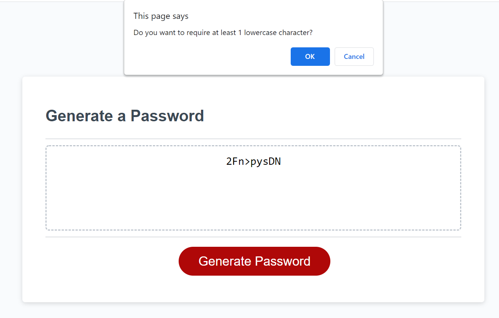

# Password Generator 
This third challenge for the Coding Bootcamp is to use javascript to add to an existing framework (html and css are already done) to generate a password.

[Requirements](#requirements)

[What I Learned](#whatILearned)

[Password Generator Screenshot](#webImage)

[Password Generator URL](#projectURL)

[Contact Me](#contactMe)

---

## Requirements
* User clicks a button to generate a new password
* After the button is clicked, the user is presented with a series of prompts for password criteria, including the length of the password
* The length of the password is a minimum of 8 characters and a maximum of 128 characters
* Confirm whether or not to include lowercase, uppercase, numeric, and/or special characters
* After getting all the desired criteria, generate the password
* Display the generated password in an alert or written to the page

---

## What I Learned
* Objects are great for keeping related data together.
* Recursion is quite handy, especially when trying to keep from replicating code.
* The built-in string manipulation in Javascript is so much nicer than rebuilding it all from scratch (I'm looking at you, early releases of C++)

---
## Password Generator Screenshot

---
## Password Generator URL

[Password Generator URL](https://bjackels5.github.io/password-generator/)

---

## Contact Me
You can reach me, Brenda Jackels, at bjackels5@gmail.com.